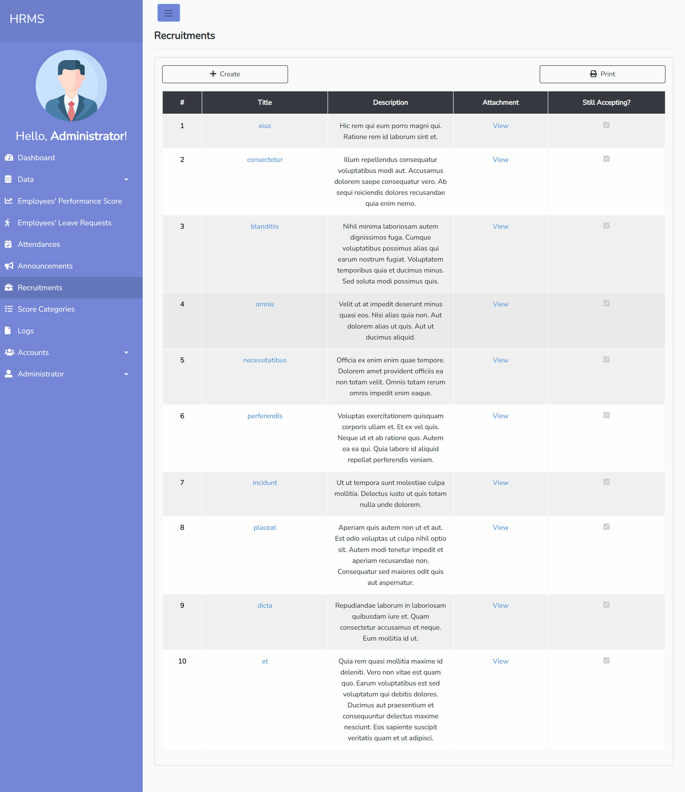

# Sistem Manajemen Sumber Daya Manusia

Ini adalah aplikasi web untuk mengelola sumber daya manusia di suatu perusahaan. Itu dibangun menggunakan Laravel 8.
 
 
Lamaran tersebut merupakan persyaratan untuk studi "On the Job Training" kuliah saya di perusahaan tempat saya bekerja.

## Langkah-langkah untuk menjalankan aplikasi ini:

1. Klik tombol `<> Kode`
2. Salin tautan repositori HTTPS/SSH
3. Jalankan perintah `git clone` di terminal Anda.
4. Instal dependensi yang diperlukan dengan menjalankan `composer install`
5. Membuat file .env dengan `cp .env.example .env` dan mengisi kolom yang diperlukan, misalnya: koneksi database, dll.
6. Hasilkan kunci aplikasi dengan menjalankan `php artisan key:generate`
7. Selanjutnya jalankan migrasi database dengan perintah `php artisanmigrate` ini.
8. Anda dapat melakukan seeding database dengan perintah `php artisan db:seed`.
9. Terakhir, sajikan aplikasi dengan perintah `php artisan serve` ini.
10. Aplikasi HRMS harus dapat diakses di browser Anda di "http://localhost:8000"

### Kredensial Masuk

Anda dapat masuk ke aplikasi dengan kredensial ini (jika Anda melakukan penyemaian basis data).

- Nama pengguna: `admin@gmail.com`
- Kata sandi: `admin`

## Tangkapan layar

**Tampilan depan**

**Layar Dasbor**

**Layar Daftar Karyawan**

**Karyawan Meninggalkan Layar**

**Layar Kehadiran**

**Layar Rekrutmen**

**Layar Detail Rekrutmen**

